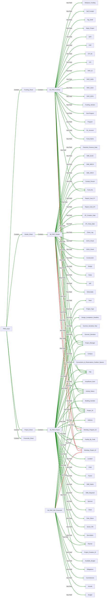

# IC Project

```mermaid
graph LR;
  PMO_Input -->|Contains| Project_Sheet
  PMO_Input -->|Contains| Details_Sheet
  PMO_Input -->|Contains| Funding_Sheet
  PMO_Input -->|Contains| Financials_Sheet
  Project_Sheet -->|Contains| tbl_PMO_Project
  Details_Sheet -->|Contains| tbl_PMO_Details
  Funding_Sheet -->|Contains| tbl_PMO_Funding
  tbl_PMO_Project -->|Has Field| Project_Creation_ID
  tbl_PMO_Project -->|Has Field| Workday_Project_ID
  tbl_PMO_Project -->|Has Field| Workday_Program_ID
  tbl_PMO_Project -->|Has Field| Project_ID
  tbl_PMO_Project -->|Has Field| Title
  tbl_PMO_Project -->|Has Field| Activity_Status
  tbl_PMO_Project -->|Has Field| Description
  tbl_PMO_Project -->|Has Field| Senior_PM
  tbl_PMO_Project -->|Has Field| Gate_Status
  tbl_PMO_Project -->|Has Field| Project_Manager
  tbl_PMO_Project -->|Has Field| Client
  tbl_PMO_Project -->|Has Field| Sponsor
  tbl_PMO_Project -->|Has Field| Planner
  tbl_PMO_Project -->|Has Field| SME_Required
  tbl_PMO_Project -->|Has Field| SME_Name
  tbl_PMO_Project -->|Has Field| Parent
  tbl_PMO_Project -->|Has Field| Child
  tbl_PMO_Project -->|Has Field| Location
  tbl_PMO_Project -->|Has Field| Facility_By_Code
  tbl_PMO_Project -->|Has Field| Address
  tbl_PMO_Project -->|Has Field| Building_Number
  tbl_PMO_Project -->|Has Field| Area/Room_Num
  tbl_PMO_Project -->|Has Field| Conventions_&_Reservations_Outdoor_Spaces
  tbl_PMO_Project -->|Has Field| Campus
  tbl_PMO_Project -->|Has Field| Summer_Sensitive
  tbl_PMO_Project -->|Has Field| Summer_Sensitive_Year
  tbl_PMO_Project -->|Has Field| Design_Completion_Deadline
  tbl_PMO_Project -->|Has Field| Project_Type
  tbl_PMO_Project -->|Has Field| Team
  tbl_PMO_Details -->|Has Field| Workday_Project_ID
  tbl_PMO_Details -->|Has Field| Workday_Program_ID
  tbl_PMO_Details -->|Has Field| Project_ID
  tbl_PMO_Details -->|Has Field| Activity_Status
  tbl_PMO_Details -->|Has Field| Title
  tbl_PMO_Details -->|Has Field| Project_Manager
  tbl_PMO_Details -->|Has Field| Fund_No
  tbl_PMO_Details -->|Has Field| Deliverable
  tbl_PMO_Details -->|Has Field| I&R
  tbl_PMO_Details -->|Has Field| Study
  tbl_PMO_Details -->|Has Field| Design
  tbl_PMO_Details -->|Has Field| Construction
  tbl_PMO_Details -->|Has Field| 23/24_Check
  tbl_PMO_Details -->|Has Field| 22/23_Check
  tbl_PMO_Details -->|Has Field| Close_Log
  tbl_PMO_Details -->|Has Field| BT_Close_Date
  tbl_PMO_Details -->|Has Field| BT_Creation_Date
  tbl_PMO_Details -->|Has Field| Report_Card_CFI
  tbl_PMO_Details -->|Has Field| Report_Card_FY
  tbl_PMO_Details -->|Has Field| Contact_Person
  tbl_PMO_Details -->|Has Field| SME_ARCH
  tbl_PMO_Details -->|Has Field| SME_MECH
  tbl_PMO_Details -->|Has Field| SME_ELEC
  tbl_PMO_Details -->|Has Field| Potential_Closeout_Date
  tbl_PMO_Funding -->|Has Field| Workday_Project_ID
  tbl_PMO_Funding -->|Has Field| Workday_Program_ID
  tbl_PMO_Funding -->|Has Field| Project_ID
  tbl_PMO_Funding -->|Has Field| Activity_Status
  tbl_PMO_Funding -->|Has Field| Title
  tbl_PMO_Funding -->|Has Field| Project_Manager
  tbl_PMO_Funding -->|Has Field| Fund_Name
  tbl_PMO_Funding -->|Has Field| Fund_No
  tbl_PMO_Funding -->|Has Field| GL_Account
  tbl_PMO_Funding -->|Has Field| Program
  tbl_PMO_Funding -->|Has Field| Sub-Program
  tbl_PMO_Funding -->|Has Field| Funding_Version
  tbl_PMO_Funding -->|Has Field| PAPI_22/23
  tbl_PMO_Funding -->|Has Field| PAPI_23/24
  tbl_PMO_Funding -->|Has Field| PAPI_24/25
  tbl_PMO_Funding -->|Has Field| PAPI_ID
  tbl_PMO_Funding -->|Has Field| CFI
  tbl_PMO_Funding -->|Has Field| CFI_No
  tbl_PMO_Funding -->|Has Field| FRP
  tbl_PMO_Funding -->|Has Field| QRT
  tbl_PMO_Funding -->|Has Field| Major_Project
  tbl_PMO_Funding -->|Has Field| Top_Shelf
  tbl_PMO_Funding -->|Has Field| Self_Funded
  tbl_PMO_Funding -->|Has Field| Multiyear_Funding
  tbl_PMO_WD_Financials -->|Has Field| Workday_Project_ID
  tbl_PMO_WD_Financials -->|Has Field| Workday_Program_ID
  tbl_PMO_WD_Financials -->|Has Field| Project_ID
  tbl_PMO_WD_Financials -->|Has Field| Activity_Status
  tbl_PMO_WD_Financials -->|Has Field| Title
  tbl_PMO_WD_Financials -->|Has Field| Project_Manager
  tbl_PMO_WD_Financials -->|Has Field| Budget
  tbl_PMO_WD_Financials -->|Has Field| Actuals
  tbl_PMO_WD_Financials -->|Has Field| Commitments
  tbl_PMO_WD_Financials -->|Has Field| Obligations
  tbl_PMO_WD_Financials -->|Has Field| Available_Budget
  tbl_PMO_WD_Financials -->|Has Field| Planner;

linkStyle 0 stroke-width:2px,fill:none,stroke:green;
linkStyle 1 stroke-width:2px,fill:none,stroke:green;
linkStyle 2 stroke-width:2px,fill:none,stroke:green;
linkStyle 3 stroke-width:2px,fill:none,stroke:green;
linkStyle 4 stroke-width:2px,fill:none,stroke:green;
linkStyle 5 stroke-width:2px,fill:none,stroke:green;
linkStyle 6 stroke-width:2px,fill:none,stroke:green;
linkStyle 7 stroke-width:2px,fill:none,stroke:green;
linkStyle 8 stroke-width:2px,fill:none,stroke:green;
linkStyle 9 stroke-width:2px,fill:none,stroke:green;
linkStyle 10 stroke-width:2px,fill:none,stroke:green;
linkStyle 11 stroke-width:2px,fill:none,stroke:green;
linkStyle 12 stroke-width:2px,fill:none,stroke:green;
linkStyle 13 stroke-width:2px,fill:none,stroke:green;
linkStyle 14 stroke-width:2px,fill:none,stroke:green;
linkStyle 15 stroke-width:2px,fill:none,stroke:green;
linkStyle 16 stroke-width:2px,fill:none,stroke:green;
linkStyle 17 stroke-width:2px,fill:none,stroke:green;
linkStyle 18 stroke-width:2px,fill:none,stroke:green;
linkStyle 19 stroke-width:2px,fill:none,stroke:green;
linkStyle 20 stroke-width:2px,fill:none,stroke:green;
linkStyle 21 stroke-width:2px,fill:none,stroke:green;
linkStyle 22 stroke-width:2px,fill:none,stroke:green;
linkStyle 23 stroke-width:2px,fill:none,stroke:green;
linkStyle 24 stroke-width:2px,fill:none,stroke:green;
linkStyle 25 stroke-width:2px,fill:none,stroke:green;
linkStyle 26 stroke-width:2px,fill:none,stroke:green;
linkStyle 27 stroke-width:2px,fill:none,stroke:green;
linkStyle 28 stroke-width:2px,fill:none,stroke:green;
linkStyle 29 stroke-width:2px,fill:none,stroke:green;
linkStyle 30 stroke-width:2px,fill:none,stroke:green;
linkStyle 31 stroke-width:2px,fill:none,stroke:green;
linkStyle 32 stroke-width:2px,fill:none,stroke:green;
linkStyle 33 stroke-width:2px,fill:none,stroke:green;
linkStyle 34 stroke-width:2px,fill:none,stroke:green;
linkStyle 35 stroke-width:2px,fill:none,stroke:green;
linkStyle 36 stroke-width:2px,fill:none,stroke:red;
linkStyle 37 stroke-width:2px,fill:none,stroke:red;
linkStyle 38 stroke-width:2px,fill:none,stroke:green;
linkStyle 39 stroke-width:2px,fill:none,stroke:green;
linkStyle 40 stroke-width:2px,fill:none,stroke:green;
linkStyle 41 stroke-width:2px,fill:none,stroke:green;
linkStyle 42 stroke-width:2px,fill:none,stroke:green;
linkStyle 43 stroke-width:2px,fill:none,stroke:green;
linkStyle 44 stroke-width:2px,fill:none,stroke:green;
linkStyle 45 stroke-width:2px,fill:none,stroke:green;
linkStyle 46 stroke-width:2px,fill:none,stroke:green;
linkStyle 47 stroke-width:2px,fill:none,stroke:green;
linkStyle 48 stroke-width:2px,fill:none,stroke:green;
linkStyle 49 stroke-width:2px,fill:none,stroke:green;
linkStyle 50 stroke-width:2px,fill:none,stroke:green;
linkStyle 51 stroke-width:2px,fill:none,stroke:green;
linkStyle 52 stroke-width:2px,fill:none,stroke:green;
linkStyle 53 stroke-width:2px,fill:none,stroke:green;
linkStyle 54 stroke-width:2px,fill:none,stroke:green;
linkStyle 55 stroke-width:2px,fill:none,stroke:green;
linkStyle 56 stroke-width:2px,fill:none,stroke:green;
linkStyle 57 stroke-width:2px,fill:none,stroke:green;
linkStyle 58 stroke-width:2px,fill:none,stroke:green;
linkStyle 59 stroke-width:2px,fill:none,stroke:green;
linkStyle 60 stroke-width:2px,fill:none,stroke:red;
linkStyle 61 stroke-width:2px,fill:none,stroke:green;
linkStyle 62 stroke-width:2px,fill:none,stroke:green;
linkStyle 63 stroke-width:2px,fill:none,stroke:green;
linkStyle 64 stroke-width:2px,fill:none,stroke:green;
linkStyle 65 stroke-width:2px,fill:none,stroke:green;
linkStyle 66 stroke-width:2px,fill:none,stroke:green;
linkStyle 67 stroke-width:2px,fill:none,stroke:green;
linkStyle 68 stroke-width:2px,fill:none,stroke:green;
linkStyle 69 stroke-width:2px,fill:none,stroke:green;
linkStyle 70 stroke-width:2px,fill:none,stroke:green;
linkStyle 71 stroke-width:2px,fill:none,stroke:green;
linkStyle 72 stroke-width:2px,fill:none,stroke:green;
linkStyle 73 stroke-width:2px,fill:none,stroke:green;
linkStyle 74 stroke-width:2px,fill:none,stroke:green;
linkStyle 75 stroke-width:2px,fill:none,stroke:green;
linkStyle 76 stroke-width:2px,fill:none,stroke:green;
linkStyle 77 stroke-width:2px,fill:none,stroke:green;
linkStyle 78 stroke-width:2px,fill:none,stroke:green;
linkStyle 79 stroke-width:2px,fill:none,stroke:green;
linkStyle 80 stroke-width:2px,fill:none,stroke:green;
linkStyle 81 stroke-width:2px,fill:none,stroke:green;
linkStyle 82 stroke-width:2px,fill:none,stroke:green;
linkStyle 83 stroke-width:2px,fill:none,stroke:green;
linkStyle 84 stroke-width:2px,fill:none,stroke:red;
linkStyle 85 stroke-width:2px,fill:none,stroke:green;
linkStyle 86 stroke-width:2px,fill:none,stroke:green;
linkStyle 87 stroke-width:2px,fill:none,stroke:green;
linkStyle 88 stroke-width:2px,fill:none,stroke:green;
linkStyle 89 stroke-width:2px,fill:none,stroke:green;
linkStyle 90 stroke-width:2px,fill:none,stroke:green;
linkStyle 91 stroke-width:2px,fill:none,stroke:green;
linkStyle 92 stroke-width:2px,fill:none,stroke:green;
linkStyle 93 stroke-width:2px,fill:none,stroke:green;
linkStyle 94 stroke-width:2px,fill:none,stroke:green;
linkStyle 95 stroke-width:2px,fill:none,stroke:green;

```
