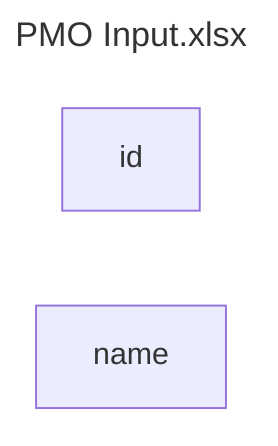
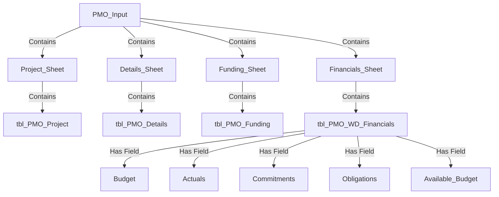

# IC Project

```mermaid
---
title: PMO Input.xlsx
---
flowchart LR
    id;
    name

```

```mermaid
graph TD;
  PMO_Input -->|Contains| Project_Sheet
  PMO_Input -->|Contains| Details_Sheet
  PMO_Input -->|Contains| Funding_Sheet
  PMO_Input -->|Contains| Financials_Sheet
  Project_Sheet -->|Contains| tbl_PMO_Project
  Details_Sheet -->|Contains| tbl_PMO_Details
  Funding_Sheet -->|Contains| tbl_PMO_Funding
  Financials_Sheet -->|Contains| tbl_PMO_WD_Financials

  tbl_PMO_WD_Financials -->|Has Field| Budget
  tbl_PMO_WD_Financials -->|Has Field| Actuals
  tbl_PMO_WD_Financials -->|Has Field| Commitments
  tbl_PMO_WD_Financials -->|Has Field| Obligations
  tbl_PMO_WD_Financials -->|Has Field| Available_Budget
```
